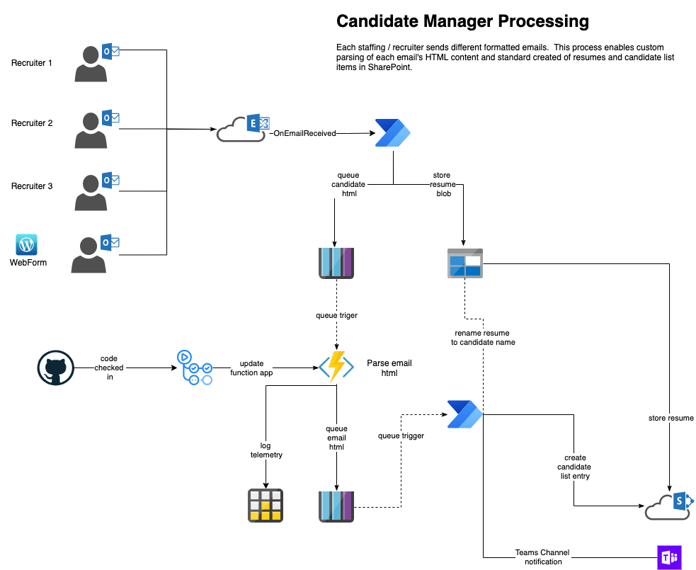

# CandidateManager
Simple Candidate Management project using Azure Functions to parse and queue HTML emails from recruiting agencies



## Degbugging Functions Locally

To debug locally, simply create a local debug profile in .vscode like the following:

```json
{
    "version": "0.2.0",
    "configurations": [
        {
            "name": ".NET Core Attach",
            "type": "coreclr",
            "request": "attach",
            "processId": "${command:pickProcess}"
        }
    ]
}
```

Then start the functions app with the following from the terminal ```func host start --dotnet-isolated-debug```.

Then attach to the dotnet process running your functions. 

See [azure-functions-dotnet-worker Debugging](https://github.com/Azure/azure-functions-dotnet-worker/wiki/Debugging) for details. 